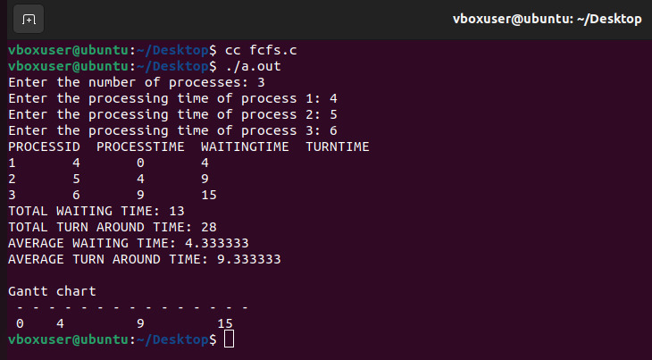
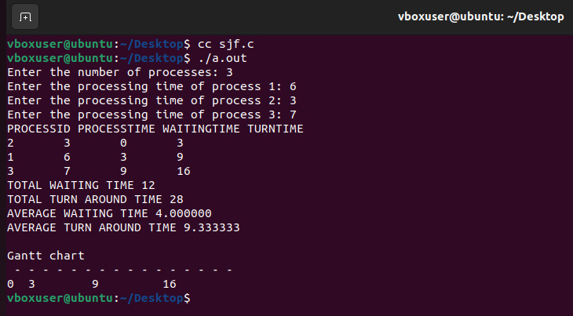
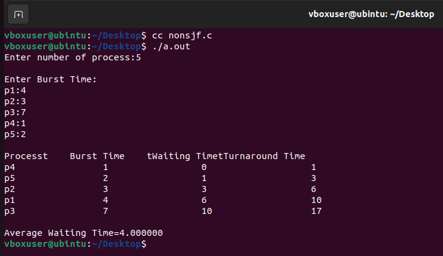
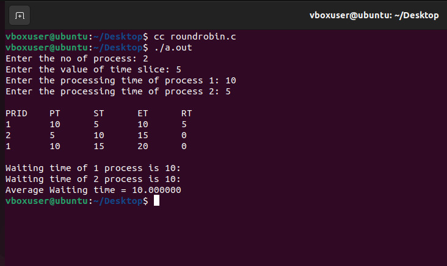
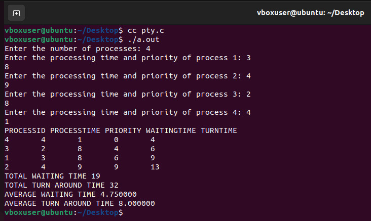
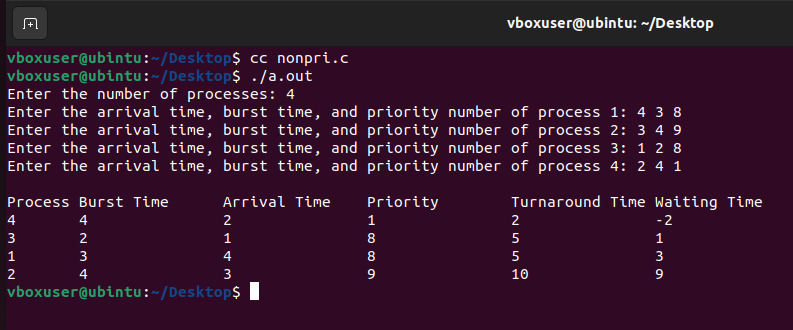

# EX.5-IMPLEMENTATION-OF-CPU-SCHEDULING-ALGORITHMS
```
Developed by : SOWMIYA N
Reg No : 212221230106
```
### AIM: 
To implement First-Come-First-Serve (FCFS) Scheduling

### ALGORITHM:

```
1.	Get the no of processes.
2.	For each process assign the process id and get the process time.
3.	Set the waiting time of the first process as 0 and its turn around time as process time.
4.	For each process calculate,
•	Waiting time of process(n) = waiting time of process (n-1) + process time of  process (n-1)
•	Turn around time of process(n) = waiting time of process (n) + process time  of process (n)
5.	Calculate the average waiting time and turn around time.
6.	Print the Gantt chart.

```
### PROGRAM:
```
#include <stdio.h>
struct pro
{
    int pid, pt, wt, tat;
};
int main()
{
    struct pro p[10];
    int n, i, twt = 0, ttat = 0;
    printf("Enter the number of processes: ");
    scanf("%d", &n);
    for (i = 1; i <= n; i++)
    {
        p[i].pid = i;
        printf("Enter the processing time of process %d: ", i);
        scanf("%d", &p[i].pt);
    }
    p[1].wt = 0;
    p[1].tat = p[1].pt;
    twt = p[1].wt;
    ttat = p[1].tat;
    for (i = 2; i <= n; i++)
    {
        p[i].wt = p[i - 1].wt + p[i - 1].pt;
        p[i].tat = p[i].wt + p[i].pt;
        twt += p[i].wt;
        ttat += p[i].tat;
    }
    printf("PROCESSID  PROCESSTIME  WAITINGTIME  TURNTIME\n");
    for (i = 1; i <= n; i++)
    {
        printf("%d\t%d\t%d\t%d\n", p[i].pid, p[i].pt, p[i].wt, p[i].tat);
    }
    printf("TOTAL WAITING TIME: %d\n", twt);
    printf("TOTAL TURN AROUND TIME: %d\n", ttat);
    float awt = (float)twt / n;
    float atat = (float)ttat / n;
    printf("AVERAGE WAITING TIME: %f\n", awt);
    printf("AVERAGE TURN AROUND TIME: %f\n", atat);
    printf("\nGantt chart\n");
    for (i = 1; i <= p[n].wt + p[n].pt; i++)
    {
        printf(" %c", '-');
    }
    printf("\n");
    for (i = 1; i <= n; i++)
    {
        int j = p[i].wt;
        printf(" %*d", j, p[i].wt);
    }
    for (i = 1; i <= p[n].wt; i++)
    {
        printf(" ");
    }
    printf("%d\n", p[n].wt + p[n].pt);
    for (i = 1; i <= p[n].wt + p[n].pt; i++)
    {
        printf(" %c", '-');
    }
    return 0;
}

```

### OUTPUT:


### RESULT: 
First-Come-First-Serve Scheduling is implemented successfully.

## Shortest Job First (SJF) Preemptive Scheduling

### AIM: 
To implement Shortest Job First (SJF) Preemptive Scheduling

### ALGORITHM:

```
1.	Get the no of processes.
2.	For each process assign the process id and get the process time.
3.	Sort the processes according to the process time.
4.	Set the waiting time of the first process as 0 and its turn around time as process time
5.	For each process calculate,
•	Waiting time of process(n) = waiting time of process (n-1) + process time of pocess(n-1)
•	Turn around time of process(n) = waiting time of process (n) + process time of process (n)
6.	Calculate the average waiting time and turn around time
7.	Print the Gantt chart.

```
### PROGRAM:

```
#include <stdio.h>
struct pro
{
    int pid;
    int pt;
    int wt;
    int tat;
};
int main()
{
    struct pro p[10], t;
    int n, i, j, twt = 0, ttat = 0;
    printf("Enter the number of processes: ");
    scanf("%d", &n);
    for (i = 1; i <= n; i++)
    {
        p[i].pid = i;
        printf("Enter the processing time of process %d: ", i);
        scanf("%d", &p[i].pt);
    }
    for (i = 1; i < n; i++)
    {
        for (j = i + 1; j <= n; j++)
        {
            if (p[i].pt >= p[j].pt)
            {
                t = p[i];
                p[i] = p[j];
                p[j] = t;
            }
        }
    }
    p[1].wt = 0;
    p[1].tat = p[1].pt;
    twt = p[1].wt;
    ttat = p[1].tat;
    for (i = 2; i <= n; i++)
    {
        p[i].wt = p[i - 1].wt + p[i - 1].pt;
        p[i].tat = p[i].wt + p[i].pt;
        twt += p[i].wt;
        ttat += p[i].tat;
    }
    printf("PROCESSID PROCESSTIME WAITINGTIME TURNTIME\n");
    for (i = 1; i <= n; i++)
    {
        printf("%d\t%d\t%d\t%d\n", p[i].pid, p[i].pt, p[i].wt, p[i].tat);
    }
    printf("TOTAL WAITING TIME %d\n", twt);
    printf("TOTAL TURN AROUND TIME %d\n", ttat);
    float awt = (float)twt / n;
    float atat = (float)ttat / n;
    printf("AVERAGE WAITING TIME %f\n", awt);
    printf("AVERAGE TURN AROUND TIME %f\n", atat);
    printf("\nGantt chart\n");
    for (i = 1; i <= p[n].wt + p[n].pt; i++)
    {
        printf(" %c", '-');
    }
    printf("\n");
    for (i = 1; i <= n; i++)
    {
        j = p[i].wt;
        printf("%*d", j, p[i].wt);
    }
    for (i = 1; i <= p[n].wt; i++)
    {
        printf(" ");
    }
    printf("%d", p[n].wt + p[n].pt);
    printf("\n");

    for (i = 1; i <= p[n].wt + p[n].pt; i++)
    {
        printf(" %c", '-');
    }

```
### OUTPUT:


### RESULT: 
Shortest Job First (SJF) preemptive scheduling is implemented successfully.
## Shortest Job First (SJF) Non-Preemptive Scheduling

### AIM: 
To implement Shortest Job First (SJF) Non-Preemptive Scheduling

### ALGORITHM:

```
1.	Input the number of processes (n) and their corresponding burst times (bt).
2.	Implement a sorting algorithm to arrange processes in ascending order based on their burst times, and it updates the process ids (p) accordingly.
3.	Calculate the waiting time for each process, starting with 0 for the first process and incrementally accumulating waiting times for subsequent processes.
4.	Turnaround times are determined by adding the burst times and waiting times for each process.
5.	Computing and displaying the average waiting time and average turnaround time for all processes.

```
### PROGRAM:

```
#include<stdio.h>
 int main()
{
    int bt[20],p[20],wt[20],tat[20],i,j,n,total=0,pos,temp;
    float avg_wt,avg_tat;
    printf("Enter number of process:");
    scanf("%d",&n);
    printf("\nEnter Burst Time:\n");
    for(i=0;i<n;i++)
    {
        printf("p%d:",i+1);
        scanf("%d",&bt[i]);
        p[i]=i+1;         
    }
   //sorting of burst times
    for(i=0;i<n;i++)
    {
        pos=i;
        for(j=i+1;j<n;j++)
        {
            if(bt[j]<bt[pos])
                pos=j;
        }
        temp=bt[i];
        bt[i]=bt[pos];
        bt[pos]=temp;
        temp=p[i];
        p[i]=p[pos];
        p[pos]=temp;
    }
    wt[0]=0;            
    for(i=1;i<n;i++)
    {
        wt[i]=0;
        for(j=0;j<i;j++)
            wt[i]+=bt[j];
  
        total+=wt[i];
    }
    avg_wt=(float)total/n;      
    total=0;
    printf("\nProcesst    Burst Time    tWaiting TimetTurnaround Time");
    for(i=0;i<n;i++)
    {
        tat[i]=bt[i]+wt[i];   
        total+=tat[i];
        printf("\np%d\t\t  %d\t\t    %d\t\t\t%d",p[i],bt[i],wt[i],tat[i]);
    }
    avg_tat=(float)total/n;    
    printf("\n\nAverage Waiting Time=%f",avg_wt);
    printf("\nAverage Turnaround Time=%fn",avg_tat);
}

```
### OUTPUT:


### RESULT: S
hortest Job First (SJF) Non-preemptive scheduling is implemented successfully.
## Round Robin (RR) Scheduling
### AIM: 
To implement Round Robin (RR) Scheduling

### ALGORITHM:
```
1. Accept the no of processes in the ready queue and time slice.
2. For each process in the ready queue accept the burst time.
3. Calculate the no of time slices required for each process.
4. If the burst time is less than the time slice then the no of time slice is 1.
5. Considering the ready queue as a circular queue, calculate
•	Total waiting time for process(n) = waiting time for process (n-1) + burst time of process (n-1) + the time difference in getting the CPU from process(n).
•	Total turn around time for process(n) = waiting time for process (n) + burst time of process (n) + the time difference in getting the CPU from  process(n).
6. Calculate the average waiting time and turn around time.

```

### PROGRAM:

```
#include <stdio.h>
struct pro
{
    int pid;
    int pt;
    int rt;
    int st;
    int et;
    int seen;
    int wt;
    int tat;
};
int main()
{
    struct pro p[10];
    int n, i, ct = 0, ts, twt = 0, ttat = 0, q[30], r = 0, f = 1;
    float awt, atat;
    printf("Enter the no of process: ");
    scanf("%d", &n);
    printf("Enter the value of time slice: ");
    scanf("%d", &ts);
    for (i = 1; i <= n; i++)
    {
        p[i].pid = i;
        printf("Enter the processing time of process %d: ", i);
        scanf("%d", &p[i].pt);
        p[i].rt = p[i].pt;
        p[i].seen = 0;
        r++;
        q[r] = p[i].pid;
    }
    printf("\nPRID\tPT\tST\tET\tRT\n");
    ct = ts;
    while (r >= f)
    {
        if (p[q[f]].seen == 0)
        {
            p[q[f]].wt = p[q[f] - 1].wt + ts;
            p[q[f]].seen = 1;
        }
        else
        {
            p[q[f]].wt = p[q[f]].wt + ct - p[q[f]].et;
        }
        p[q[f]].st = ct;
        p[q[f]].et = ct + ts;
        p[q[f]].rt = p[q[f]].rt - ts;
        if (p[q[f]].rt > 0)
        {
            r++;
            q[r] = q[f];
        }
        ct = ct + ts;
        f++;
        printf("%d\t%d\t%d\t%d\t%d\n", q[f - 1], p[q[f - 1]].pt, p[q[f - 1]].st, p[q[f - 1]].et, p[q[f - 1]].rt);
    }
    for (i = 1; i <= n; i++)
    {
        printf("\nWaiting time of %d process is %d:", i, p[i].wt);
        twt += p[i].wt;
    }
    awt = (float)twt / n;
    printf("\nAverage Waiting time = %f\n", awt);

    return 0;
}

```
### OUTPUT:


### RESULT: 
Round Robin (RR) Scheduling is implemented successfully.

## Priority Preemptive Scheduling
### AIM: 
To implement Priority Preemptive Scheduling

### ALGORITHM:
```
1.	Get the no of processes.
2.	For each process assign the process id and get the process time and the priority value.
3.	Sort the processes according to the priority value.
4.	Set the waiting time of the first process as 0 and its turn around time as process time.
5.	For each process calculate,
•	Waiting time of process(n) = waiting time of process (n-1) + process time of process(n-1)
•	Turn around time of process(n) = waiting time of process(n) + process time of process (n)
6. Calculate the average waiting time and turn around time.

```

### PROGRAM:

```
#include <stdio.h>
#include <stdlib.h>
struct pro
{
    int pid;
    int pr;
    int pt;
    int wt;
    int tat;
};
int main()
{
    struct pro p[10], t;
    int n, i, j, twt = 0, ttat = 0;
    float awt, atat;
    printf("Enter the number of processes: ");
    scanf("%d", &n);

    for (i = 1; i <= n; i++)
    {
        p[i].pid = i;
        printf("Enter the processing time and priority of process %d: ", i);
        scanf("%d %d", &p[i].pt, &p[i].pr);
    }
    for (i = 1; i < n; i++)
    {
        for (j = i + 1; j <= n; j++)
        {
            if (p[i].pr >= p[j].pr)
            {
                t = p[i];
                p[i] = p[j];
                p[j] = t;
            }
        }
    }

    p[1].wt = 0;
    p[1].tat = p[1].pt;
    twt = p[1].wt;
    ttat = p[1].tat;
    for (i = 2; i <= n; i++)
    {
        p[i].wt = p[i - 1].wt + p[i - 1].pt;
        p[i].tat = p[i].wt + p[i].pt;
        twt += p[i].wt;
        ttat += p[i].tat;
    }
    printf("PROCESSID PROCESSTIME PRIORITY WAITINGTIME TURNTIME\n");
    for (i = 1; i <= n; i++)
    {
        printf("%d\t%d\t%d\t%d\t%d\n", p[i].pid, p[i].pt, p[i].pr, p[i].wt, p[i].tat);
    }
    printf("TOTAL WAITING TIME %d\n", twt);
    printf("TOTAL TURN AROUND TIME %d\n", ttat);
    awt = (float)twt / n;
    atat = (float)ttat / n;
    printf("AVERAGE WAITING TIME %f\n", awt);
    printf("AVERAGE TURN AROUND TIME %f\n", atat);
    getchar(); // Wait for a keypress
    return 0;
}

```
### OUTPUT:


### RESULT: 
Priority Preemptive scheduling is implemented successfully.

## Priority Non-Preemptive Scheduling

### AIM: 
To implement Priority Non-Preemptive Scheduling

### ALGORITHM:

```
1.	Defining a structure to store the details of each process, such as the process ID, arrival time, burst time, and priority number.
2.	Create an array of structures to store the details of all the processes.
3.	Take input from the user for the number of processes and their details such as arrival time, burst time, and priority number.
4.	Sort the processes based on their priority number using the Selection Sort algorithm
5.	Calculate the turnaround time and waiting time for each process and output the results

```
### PROGRAM:
```
#include <stdio.h>
struct process {
    int pid;
    int arrivaltime;
    int bursttime;
    int prioritynumber;
    int tat;
    int waitingtime;
};
int main() {
    int n, i, j, pos, temp;
    int tat = 0, wt = 0;
    printf("Enter the number of processes: ");
    scanf("%d", &n);
    struct process pt[n];
    for (i = 0; i < n; i++) {
        printf("Enter the arrival time, burst time, and priority number of process %d: ", i + 1);
        scanf("%d %d %d", &pt[i].arrivaltime, &pt[i].bursttime, &pt[i].prioritynumber);
        pt[i].pid = i + 1;
    }
    // Sorting processes based on priority number using Selection Sort
    for (i = 0; i < n; i++) {
        pos = i;
        for (j = i + 1; j < n; j++) {
            if (pt[j].prioritynumber < pt[pos].prioritynumber)
                pos = j;
        }
        struct process temp = pt[i];
        pt[i] = pt[pos];
        pt[pos] = temp;
    }
    // Calculate turnaround time and waiting time for each process
    for (i = 0; i < n; i++) {
        tat += pt[i].bursttime;
        pt[i].tat = tat - pt[i].arrivaltime;
        wt += pt[i].tat - pt[i].bursttime;
        pt[i].waitingtime = wt;
    }
    // Print the results
    printf("\nProcess\tBurst Time\tArrival Time\tPriority\tTurnaround Time\tWaiting Time\n");
    for (i = 0; i < n; i++) {
        printf("%d\t%d\t\t%d\t\t%d\t\t%d\t\t%d\n", pt[i].pid, pt[i].bursttime, pt[i].arrivaltime, pt[i].prioritynumber, pt[i].tat, pt[i].waitingtime);
    }
    return 0;
}

```

### OUTPUT:


### RESULT: 
Priority Non-preemptive scheduling is implemented successfully.

